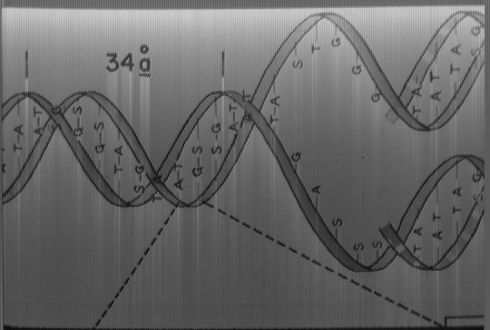
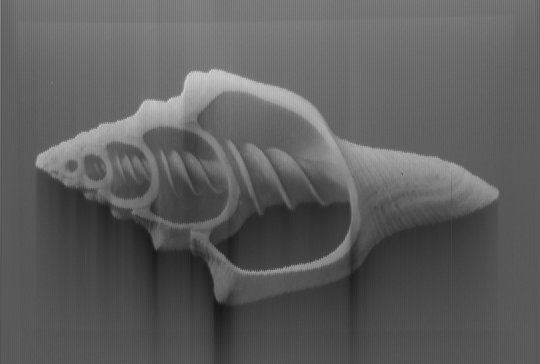

# Voyager Golden Record Image Decoder

A Python script to extract images encoded as audio on the Voyager Golden Record.

Based on [foodini/voyager](https://github.com/foodini/voyager).

## How the Images are Encoded

The Voyager Golden Record contains 116 images encoded as analog audio signals at **384 kHz** sample rate (78 images per stereo channel).




### Signal Format

Each image is composed of **540 traces** (scan lines), with each trace containing **364 pixels**.

#### Trace Structure
- **Sync pulse**: Each trace begins with a high-amplitude spike followed by a falling edge
- **Image data**: ~2700 samples representing 364 pixels
- **Trace spacing**: Alternates between ~3100 and ~3300 samples

#### Pixel Encoding
- Pixel intensity is encoded as the **average amplitude** of the audio signal
- Lower amplitude = brighter pixel (inverted)
- Signal range: approximately -0.26 to +0.18
- A cosine-based lookup table maps signal values to 0-255 intensity

### Image Parameters

| Parameter | Value |
|-----------|-------|
| Sample rate | 384,000 Hz |
| Frame height | 364 pixels |
| Traces per frame | 540 |
| Samples per trace | 3000-3400 |
| Images per channel | 78 |
| Total images | 156 (116 unique + color channels) |

### Color Images

Some images are transmitted as three separate frames (Red, Green, Blue channels) that must be combined to produce a color image. The encoding includes metadata arrays specifying:
- Which channel (R/G/B or grayscale) each frame represents
- Image orientation (normal, rotate left, rotate right)

## Requirements

- Python 3
- NumPy
- SciPy
- FFmpeg (for non-WAV input files)

```bash
pip install numpy scipy
```

## Usage

```bash
# From WAV file (384 kHz stereo)
python extract_images.py 384kHzStereo.wav

# From FLAC file
python extract_images.py 384kHzStereo.flac
```

Images are extracted to `extracted_images/` directory in PGM format (grayscale).

## Audio File Recommendations

- **WAV/FLAC**: Lossless, best quality
- **Opus/MP3**: Lossy compression degrades image quality significantly because:
  - MP3 is limited to 48 kHz sample rate (loses 87% of data)
  - Lossy codecs are optimized for human hearing, not data signals

## References

- [How to Decode the Images on the Voyager Golden Record](https://boingboing.net/2017/09/05/how-to-decode-the-images-on-th.html)
- [Original audio files](https://drive.google.com/drive/folders/0B0Swx_1rwA6XcFFLc29ncFJSZmM)
